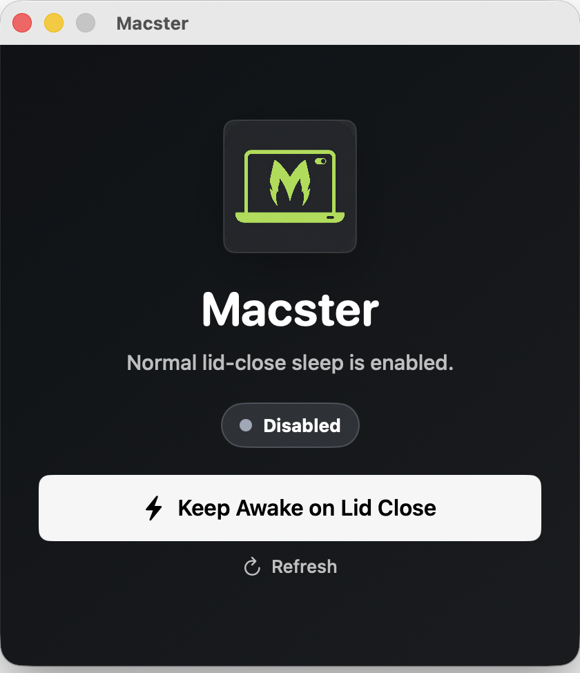

<div align="center">
  

  # Macster

  A tiny native macOS toggle for lid-close awake mode.

  [](https://github.com/ApocalixDeLuque/Macster/releases/latest)
  [](https://github.com/ApocalixDeLuque/Macster/actions/workflows/release.yml)
  [](LICENSE)
  [](https://www.apple.com/macos/)
  [](Package.swift)

  <br>

  
</div>

## Why

Macster replaces a long terminal command with a small visual toggle. It is built for clamshell setups, external displays, remote sessions, downloads, and long-running local work where the Mac should stay awake after the lid closes.

## Highlights

| Area | Detail |
| --- | --- |
| UI | One native SwiftUI window with a status badge, one primary toggle, and refresh. |
| Runtime | No web view, no analytics, no updater, no network calls. |
| Dependencies | No Homebrew packages or third-party runtimes. Release builds include the bundled helper. |
| Safety | The helper is installed once and allowlisted only for Macster's exact enable/disable commands. |
| Portability | No hardcoded local paths, IP addresses, hostnames, device names, or user names in the source. |

## Install

1. Download the latest `Macster-<version>.dmg` from [Releases](https://github.com/ApocalixDeLuque/Macster/releases/latest).
2. Open the DMG.
3. Drag `Macster.app` into Applications.
4. Open Macster.

> [!NOTE]
> Macster is ad-hoc signed for open-source distribution. If macOS Gatekeeper blocks the first launch, open it from Finder with right click -> Open.

## Usage

Open Macster and press the main button.

| Button | Result |
| --- | --- |
| `Keep Awake on Lid Close` | Disables macOS sleep for lid-close/clamshell use. |
| `Let Lid Close Sleep` | Restores normal lid-close sleep behavior. |

The first toggle may ask for administrator approval to install Macster's helper. After that, normal toggles should not ask for a password because the helper is allowlisted for only the two Macster commands.

Touch ID availability for the one-time administrator prompt is controlled by macOS. If your Mac allows Touch ID for administrator authorization, macOS can offer it; otherwise it will ask for the account password.

## How It Works

Macster reads and writes macOS power settings with Apple-provided tools:

| Tool | Purpose |
| --- | --- |
| `/usr/bin/pmset` | Reads and updates power-management values. |
| `/usr/bin/caffeinate` | Holds the active keep-awake assertion. |
| `/bin/launchctl` | Starts/removes the user-level keep-awake job. |
| `/usr/bin/sudo` | Runs the installed helper after one-time setup. |

When enabling, Macster:

1. Reads the current AC and battery settings with `pmset -g custom`.
2. Saves only the settings it changes.
3. Installs or updates the bundled helper if needed.
4. Starts the keep-awake job.
5. Sets `sleep`, `disksleep`, `displaysleep`, `standby`, `powernap`, and `disablesleep`.

When disabling, Macster:

1. Installs or updates the bundled helper if needed.
2. Removes the keep-awake job.
3. Turns `SleepDisabled` off.
4. Restores the saved settings if a backup exists.

### Helper Scope

Macster installs:

```text
/usr/local/libexec/macsterctl
/etc/sudoers.d/macster
```

The sudoers file is generated for the current macOS user at install time and only permits these exact commands:

```text
/usr/local/libexec/macsterctl enable
/usr/local/libexec/macsterctl disable
```

It does not grant shell access, arbitrary `pmset` access, or permission to run other commands.

## Stored Data

Macster stores one local backup file so it can restore your previous power settings:

```text
~/Library/Application Support/Macster/power-settings-backup.json
```

It does not store credentials, secrets, device identifiers, network addresses, or analytics data.

## Limitations

> [!IMPORTANT]
> Macster controls macOS sleep behavior. Some MacBook models can still blank the built-in panel when the physical lid is closed because that behavior is handled by macOS and hardware. The practical goal is to keep the Mac awake for clamshell use, external displays, remote sessions, long-running tasks, and downloads.

## Build

Requirements:

- macOS 13 or newer
- Swift 6 or newer
- Command Line Tools for Xcode

Build release artifacts:

```sh
./scripts/build-release.sh
```

Artifacts are written to `dist/`:

| Artifact | Purpose |
| --- | --- |
| `Macster.app` | App bundle. |
| `Macster-<version>.dmg` | User-facing installer image. |
| `Macster-<version>.zip` | Zipped app bundle. |
| `checksums.txt` | SHA-256 checksums. |

Run locally:

```sh
swift run Macster
```

## Release

Manual release workflow:

```sh
gh workflow run release.yml --repo ApocalixDeLuque/Macster --ref main -f version=0.1.2
```

The workflow builds the app, creates/uploads the DMG and ZIP, and publishes checksums.

## License

MIT. See [LICENSE](LICENSE).
